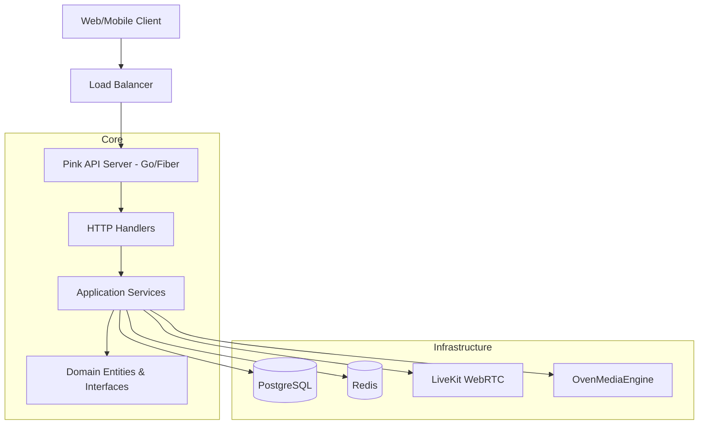

# Pink Backend - Mimari Tasarım

> Versiyon: 1.1 | Tarih: 2025-12-28

---

## 📋 İçindekiler

1. [Mimari Genel Bakış](#mimari-genel-bakış)
2. [Katmanlı Mimari (Hexagonal)](#katmanlı-mimari-hexagonal)
3. [Proje Yapısı](#proje-yapısı)
4. [Veri Akışı](#veri-akışı)
5. [Modüller Arası İletişim](#modüller-arası-iletişim)

---

## Mimari Genel Bakış

Pink Backend, **Modular Monolith** yapısında tasarlanmış olup, **Clean Architecture (Hexagonal)** prensiplerini takip eder. Bu yaklaşım, iş mantığını (Business Logic) teknik detaylardan (Database, HTTP, External SDKs) izole ederek test edilebilirliği ve sürdürülebilirliği artırır.

### High-Level Architecture



---

## Katmanlı Mimari (Hexagonal)

Pink Backend dört ana katmandan oluşur. Bağımlılıklar daima dıştan içe (Domain'e) doğrudur.

### 1. Domain Layer (`internal/domain`)
En içteki katman. İş kuralları, entity'ler ve servislerin ihtiyaç duyduğu interface tanımlarını (Ports) içerir.
- **Entities**: `User`, `Server`, `Channel`, `Post`, `Stream`.
- **Interfaces**: `Repository` tanımları, `EventPublisher`.

### 2. Application Layer (`internal/application`)
Use-case orchestration katmanı. Domain entity'lerini ve interface'lerini kullanarak spesifik senaryoları (`Register`, `CreateServer`, `StartStream`) işletir.

### 3. Adapters Layer (`internal/adapters`)
Dış dünya ile entegrasyonu sağlar.
- **HTTP**: Fiber handlers, middleware, DTOs.
- **WebSocket**: Hub yönetimi ve event dağıtımı.

### 4. Infrastructure Layer (`internal/infrastructure`)
Teknik implementasyonları içerir.
- **Postgres**: SQL sorguları ve repository gerçekleştirmeleri.
- **Cache**: Redis tabanlı caching.
- **LiveKit/OME**: Streaming ve WebRTC SDK entegrasyonları.
- **Auth**: JWT üretimi ve doğrulaması.

---

## Proje Yapısı

Gerçek dizin yapısı aşağıdaki gibidir:

```
Backend/
├── cmd/
│   └── api/                # Main entry point
├── internal/
│   ├── adapters/
│   │   └── http/           # Handlers, Router, Middleware, DTO
│   ├── application/        # Application services (Use cases)
│   │   ├── user/
│   │   ├── server/
│   │   ├── live/
│   │   └── ...
│   ├── domain/             # Core entities & repository interfaces
│   │   ├── user/
│   │   ├── server/
│   │   ├── live/
│   │   └── ...
│   ├── infrastructure/     # DB, Auth, External SDKs implementation
│   │   ├── postgres/
│   │   ├── redis/
│   │   ├── livekit/
│   │   ├── ome/
│   │   └── ws/             # WebSocket infra
│   └── pkg/                # Shared utilities (logger, validation, id)
├── migrations/             # SQL migration files
├── scripts/                # Task runner, Makefile
└── docs/                   # Documentation
```

---

## Veri Akışı

Bir HTTP isteğinin işlenme süreci:

1.  `Fiber Router` isteği karşılar.
2.  `Middleware` (Auth, Logging) isteği doğrular.
3.  `HTTP Handler` (Adapter) isteği parse eder ve DTO'yu `Application Service` komutuna dönüştürür.
4.  `Application Service` iş mantığını yürütür, `Domain Entity` oluşturur/günceller.
5.  `Infrastructure (Postgres)` aracılığıyla veri kalıcı hale getirilir.
6.  `Application Service` sonucu `Handler`'a döner.
7.  `Handler` sonucu uygun JSON formatında (DTO) client'a iletir.

---

## Modüller Arası İletişim

Modüller (User, Server, Post vb.) birbirlerinin concrete implementasyonlarına değil, interface'lerine bağımlıdır.

```go
// Örnek: Feed servisinin kullanıcı verisine ihtiyacı varsa
type UserProvider interface {
    GetByID(ctx context.Context, id string) (*user.User, error)
}
```

Bu yapı sayesinde:
- Modülleri birbirinden bağımsız test edebiliriz.
- Bir modüldeki değişiklik diğerini etkilemez.
- İleride bazı modüller kolayca ayrı servislere (microservices) dönüştürülebilir.

---

*Sonraki: [API Specification](./03-api-specification.md)*
