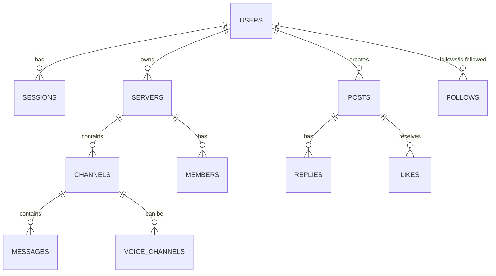

# Pink Backend - Veritabanı Tasarımı

> Versiyon: 1.2 | Tarih: 2025-12-28 | Veritabanı: PostgreSQL 16

---

## 📋 Genel Bakış

Pink Backend, verileri depolamak için PostgreSQL kullanır. Performans ve ölçeklenebilirlik için "Instagram-style" denormalize edilmiş sayaçlar ve JSONB alanları barındırır. ID formatı olarak sıralanabilir `VARCHAR(26)` (ULID/Custom format) tercih edilmiştir.

---

## 🏗️ Veri Modeli (ER Diyagramı)

---

## 🗄️ Temel Tablolar

### 1. Kullanıcılar (`users`)
Kullanıcı hesap bilgilerini ve meta verilerini saklar.

| Kolon | Tip | Açıklama |
|-------|-----|----------|
| `id` | VARCHAR(26) | Primary Key |
| `handle` | VARCHAR(20) | Benzersiz kullanıcı adı (@johndoe) |
| `display_name`| VARCHAR(50) | Görünen isim |
| `email` | VARCHAR(255) | Benzersiz email |
| `password_hash`| VARCHAR(255) | bcrypt hash |
| `avatar_gradient`| TEXT[] | Profil icon gradient'ı (2 renk) |
| `followers_count`| INT | Takipçi sayısı (denormalize) |
| `posts_count` | INT | Post sayısı (denormalize) |

### 2. Sunucular (`servers`)
Discord tarzı topluluk sunucularını tanımlar.

| Kolon | Tip | Açıklama |
|-------|-----|----------|
| `id` | VARCHAR(26) | Primary Key |
| `handle` | VARCHAR(20) | Sunucu handle'ı (@pink_dev) |
| `name` | VARCHAR(100) | Sunucu adı |
| `owner_id` | VARCHAR(26) | Sahip (Users reference) |
| `icon_gradient`| TEXT[] | Sunucu simgesi |
| `is_public` | BOOLEAN | Genel erişime açık mı? |

### 3. Kanallar (`channels`)
Sunucu içindeki iletişim birimleri.

| Kolon | Tip | Açıklama |
|-------|-----|----------|
| `id` | VARCHAR(26) | Primary Key |
| `server_id` | VARCHAR(26) | Bağlı olduğu sunucu |
| `name` | VARCHAR(100) | Kanal adı |
| `type` | VARCHAR(20) | text, voice, video, category, announcement |
| `parent_id` | VARCHAR(26) | Kategori bağlılığı (opsiyonel) |
| `position` | INT | Sıralama numarası |

### 4. Mesajlar (`channel_messages`)
Kanallarda paylaşılan anlık mesajlar.

| Kolon | Tip | Açıklama |
|-------|-----|----------|
| `id` | VARCHAR(26) | Primary Key |
| `channel_id` | VARCHAR(26) | Kanal reference |
| `author_id` | VARCHAR(26) | Gönderen reference |
| `content` | TEXT | Mesaj içeriği |
| `reply_to_id` | VARCHAR(26) | Yanıtlanan mesaj (self-reference) |

### 5. Sosyal Akış (`posts`)
Twitter tarzı global akış paylaşımları.

---

## 🚀 Optimizasyonlar ve İndeksleme

1.  **B-Tree Indexes**: Sık sorgulanan `handle`, `email` ve linkli ID kolonlarında (FK) standart indeksleme.
2.  **GIN Indexes**: `JSONB` tabanlı `metadata` alanlarında hızlı arama için.
3.  **Partial Indexes**: `is_active = TRUE` gibi sadece aktif kayıtları içeren küçük indeksler.
4.  **Triggers**: `updated_at` kolonunun otomatik güncellenmesi ve sayaçların (`followers_count` vb.) senkronizasyonu için trigger-based mimari.

---

## 🔄 Migration Yönetimi

Migration'lar `Backend/migrations` dizininde, artan sayısal prefixlerle (`000001`, `000002`...) saklanır.
- **Up**: Şemayı ileriye taşır.
- **Down**: Güvenli geri dönüş sağlar (Production'da dikkatli kullanılmalıdır).

---

*Sonraki: [Security Implementation](./05-security.md)*
